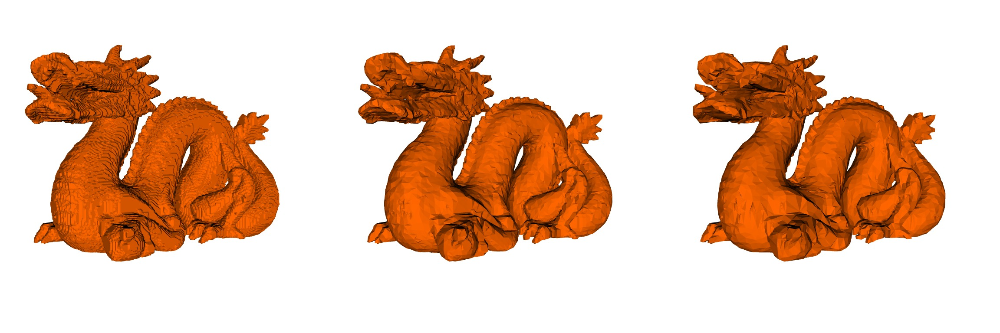
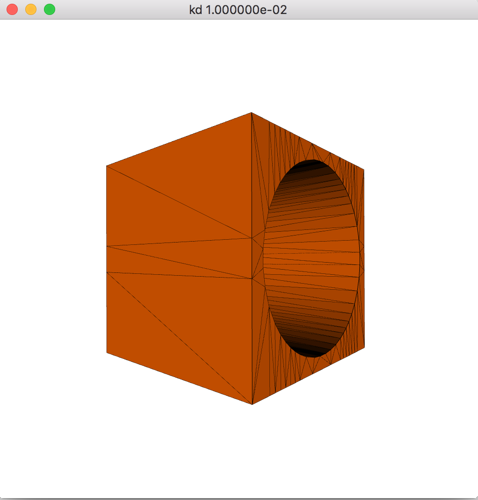
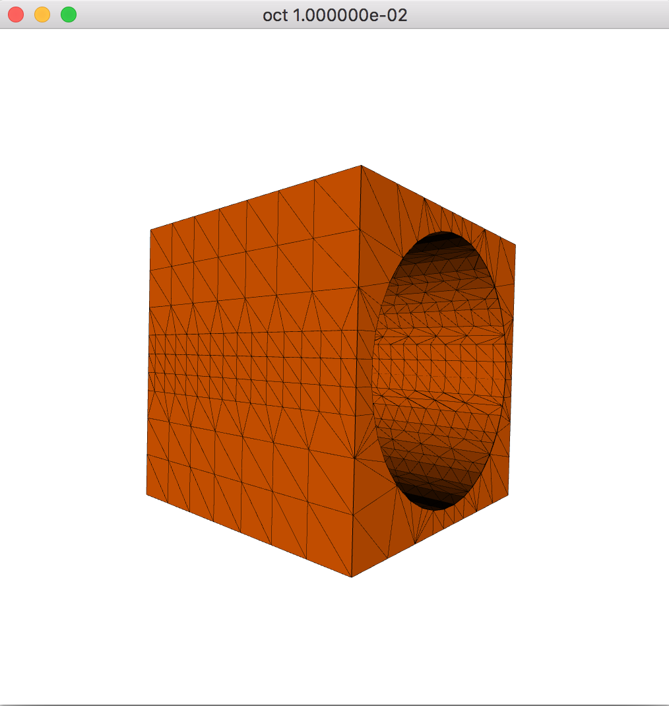

# Discrete k-d Tree Hierarchy for Isosurface Extraction




This repository is the origin implementation of  *Discrete k-d Tree Hierarchy for Isosurface Extraction*. The picture above shows three reconstructed results of stanford dragon using uniform grid, octree and k-d tree under an error threshold of 1e0. 

The triangle counts for those results are shown below. 

| uniform grid | octree | k-d tree |
| ------------ | ------ | -------- |
| 309,962      | 35,836 | 22,608   |

It's a classical test that shows the isosurface extracted from k-d tree obtains almost half the triangles of the one extracted from octree.

Octree-based method is based on works of Schaefer et al. (Manifold dual contouring).

### Project Dependency

* glm 0.9.9
* glew 2.1.0
* glfw 3.2.1

### Build and run OpenGL viewer

```bash
mkdir build
cd build
cmake .. && make
bin/opengl_viewer [options]
```

After a few seconds, you should be able to see a CSG defined geometry shaded with color and wireframe. Try drag and scroll mouse to view the extraction result.



**Triangle count: 352**

The argument "—strucrture" allows you to compare the extraction result of octree and k-d tree.

```bas
bin/opengl_viewer -s oct
```



**Triangle count: 2384**

For more CSG result, edit src/examples/main.cpp and recompile the project

### License

Permission is hereby granted, free of charge, to any person obtaining a copy of this software and associated documentation files (the "Software"), to deal in the Software without restriction, including without limitation the rights to use, copy, modify, merge, publish, distribute, sublicense, and/or sell copies of the Software, and to permit persons to whom the Software is furnished to do so, subject to the following conditions:

The above copyright notice and this permission notice shall be included in all copies or substantial portions of the Software.

THE SOFTWARE IS PROVIDED "AS IS", WITHOUT WARRANTY OF ANY KIND, EXPRESS OR IMPLIED, INCLUDING BUT NOT LIMITED TO THE WARRANTIES OF MERCHANTABILITY, FITNESS FOR A PARTICULAR PURPOSE AND NONINFRINGEMENT. IN NO EVENT SHALL THE AUTHORS OR COPYRIGHT HOLDERS BE LIABLE FOR ANY CLAIM, DAMAGES OR OTHER LIABILITY, WHETHER IN AN ACTION OF CONTRACT, TORT OR OTHERWISE, ARISING FROM, OUT OF OR IN CONNECTION WITH THE SOFTWARE OR THE USE OR OTHER DEALINGS IN THE SOFTWARE.